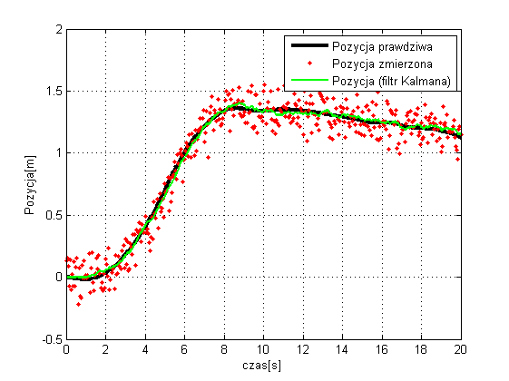
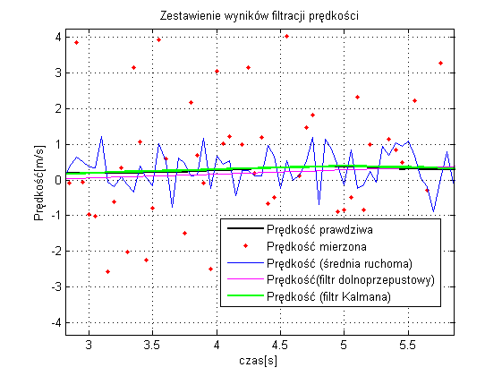
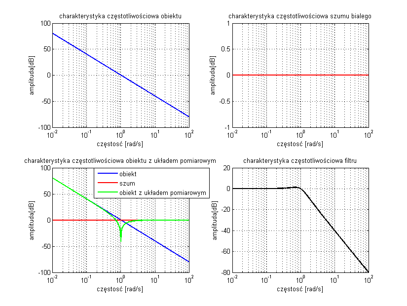

Dylematy związane ze stosowaniem Filtru Kalmana w prognozowaniu zjawisk ekonomicznych
=========

### Materiały związane z referatem Mateusza Stachnika i Zygmunta Zawadzkiego wygłoszonego na Otwartym Seminarium Katedry Statystyki UEK 13.05.2014

#### Zawartość

W repozytorium można znaleźć prezentację, wszystkie obrazki które zostały w niej użyte, dodatkowe materiały związane z wyprowadzeniami wzorów w filtrze Kalmana, jak i proste kody w R z przykładami.

Trwają prace nad dodaniem kodów z Matlaba użytych w prezentacji i poprawienie materiałów dodatkowych.

#### Przykładowe rysunki z prezentacji

 

 

 
